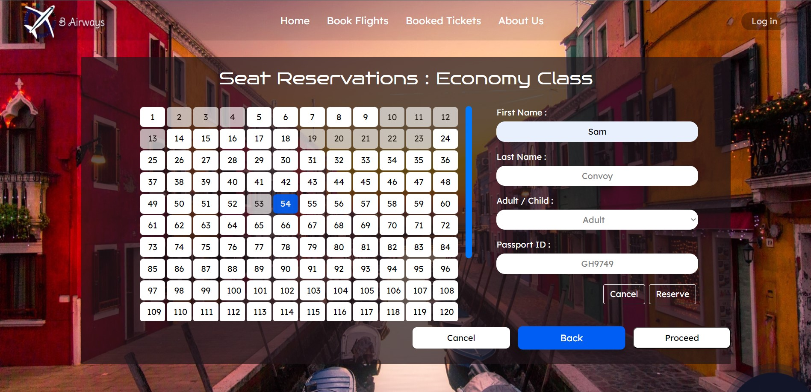
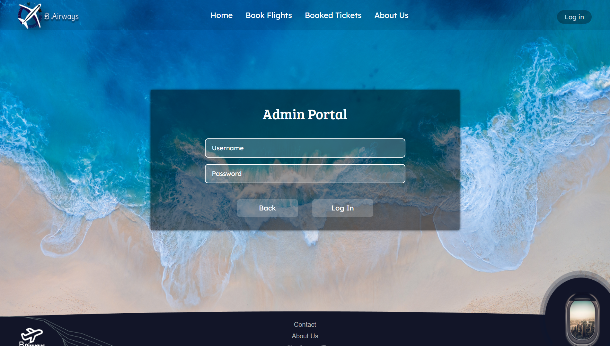
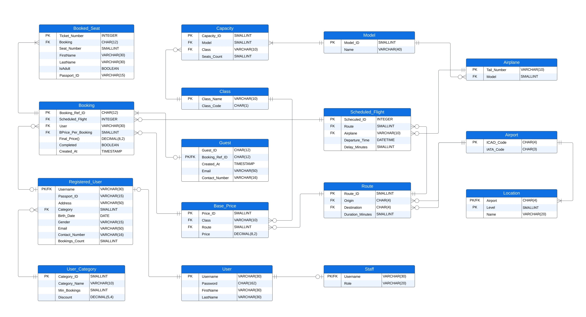
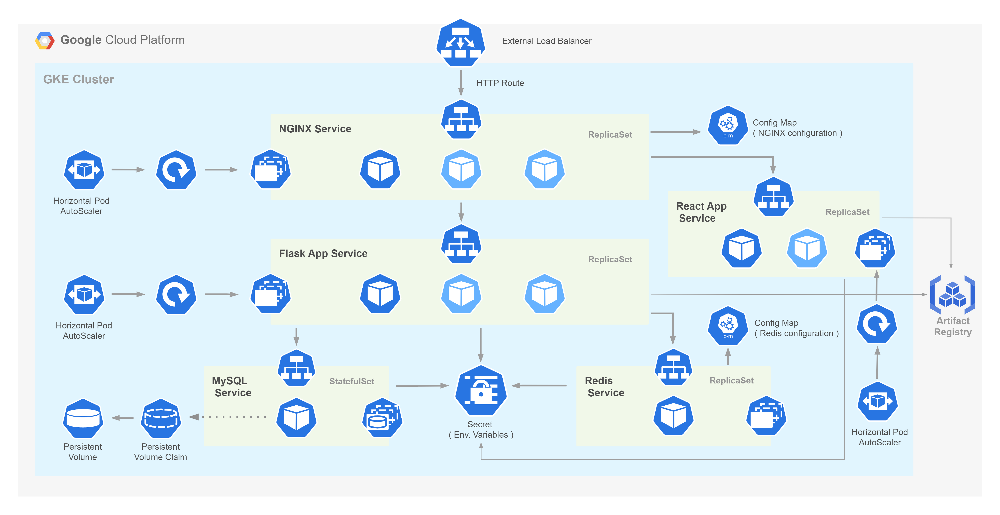
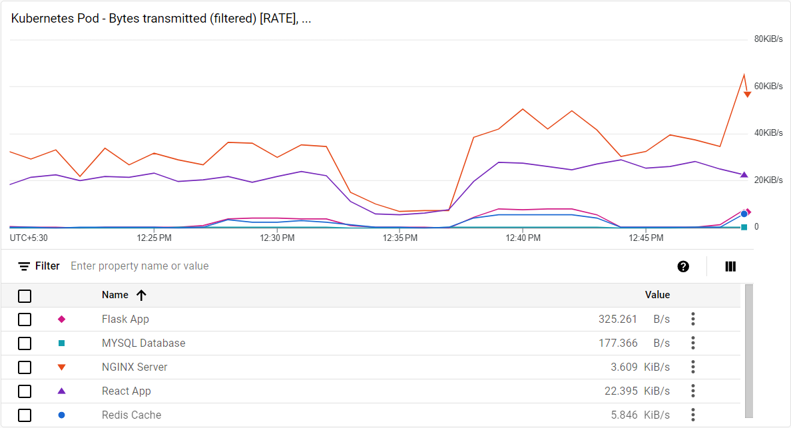

<h1 align="center">✈️ Airline Reservation System ✈️</h1>

This system was developed with the aim of automating the ticket booking process of B airlines. Employing a three-tier architecture, the system was designed to uphold scalability and maintainability. Leveraging MySQL as the database management system, the solution optimizes data handling through the adept utilization of SQL. The frontend interface, developed with React.js, delivers an user-friendly experience for both customers and administrators. Flask backend orchestrates business logic execution and facilitates seamless interaction with the database, ensuring robust performance and application security.

## Frontend

### Flight Search & Seat Reservation

### Pending Payments & Payment Success

### Admin Portal

## Backend & Database

### Logical View of Database

### SQL stored procedures

The database has been constructed with the implementation of SQL constraints, procedures, functions, and triggers to uphold the ACID (Atomicity, Consistency, Isolation, Durability) properties. This ensures the application's adherence to data integrity and reliability standards.

Functions :

- Generating Guest IDs while adhering to the unique value constraint.
- Generating Booking Reference IDs while adhering to the unique value constraint.
- Calculating the Final Price based on user type, travel class type, route, and the number of seats booked.

Procedures :

- Creating a new booking for a guest user after validating all booking details.
- Creating a new booking for a registered user after validating all booking details.
- Updating a booking as completed and adjusting the user category based on the number of completed bookings.
- Scheduling a flight, ensuring that the same airplane cannot be scheduled simultaneously for two flights.
- Creating Airports, ensuring that both the Airport and its Location records are either created together or not created at all.
- Creating Models, ensuring that both the Model and its Capacity records are either created together or not created at all.
- Creating Routes, ensuring that both the Route and its Base Price records are either created together or not created at all.

Triggers :

- Checking whether both Base Price and Scheduled Flight records related to a booking reference the same route ID before creating a booking.
- Verifying whether a booking has at least one booked seat before completing the booking.
- Ensuring that the origin and destination of a route are distinct airports before creating the route.
- Checking whether an airport, airplane, model, or route is referenced by flights with at least one paid booking before deleting the corresponding record.
- Verifying whether a scheduled flight has at least one paid booking before deleting the scheduled flight record.

### Optimizations

- Server-Side Caching : Enhanced performance through the implementation of server-side caching (using a redis cache) for frequently accessed APIs delivering relatively static content. This strategy significantly reduces the number of requests made to the database, leading to decreased response times.

- Indexing : Implemented indexing on tables frequently accessed and containing large datasets, enabling the system to swiftly locate and retrieve specific records. This optimization reduces the time and resources required for data retrieval operations. Indexed tables include Scheduled Flight, Registered User, Guest, Booking, Booked_Seat, and Guest.

### Security

- Authentication and Authorization : SQL roles were established to mitigate unauthorized accesses at the database level. Additionally, JWT (JSON Web Tokens) Authentication was integrated at the application level, providing an additional layer of authentication and authorization to manage API access.

- Data security : Utilized Werkzeug security encryption to hash and securely store passwords within the database, ensuring the protection of sensitive information.

- Preventing SQL Injection Attacks : Implemented Regular Expression validations and prepared statements to restrict database operations to permitted SQL queries only. This measure safeguards against malicious attempts to manipulate the database.

- Throttling : Employed rate limitations to restrict the number of bookings created within a short timeframe from a single IP address, effectively countering brute force attacks targeting seat reservations.

## Deployment

### Architecture

The system was deployed on Google Kubernetes Engine (GKE) to ensure scalability, reliability, and high availability. The deployment architecture consists of a web server (NGINX) acting as a reverse proxy, routing incoming requests to the frontend and backend services, then a frontend service, running the React.js application, a backend service, executing the Flask application, and a database service, managing the MySQL database. Additionally, a Redis cache service was deployed to enhance performance through server-side caching. 

Web Server and backend servers were configured to horizontally autoscale based on CPU utilization, ensuring optimal resource allocation and cost efficiency. Application configuration and environment variables were stored in ConfigMaps and Secrets, ensuring secure and centralized management of application settings. An External Load Balancer was employed to distribute incoming traffic across the web servers. Rest of the services were restricted only to internal traffic, ensuring secure communication within the cluster.

### Monitoring

